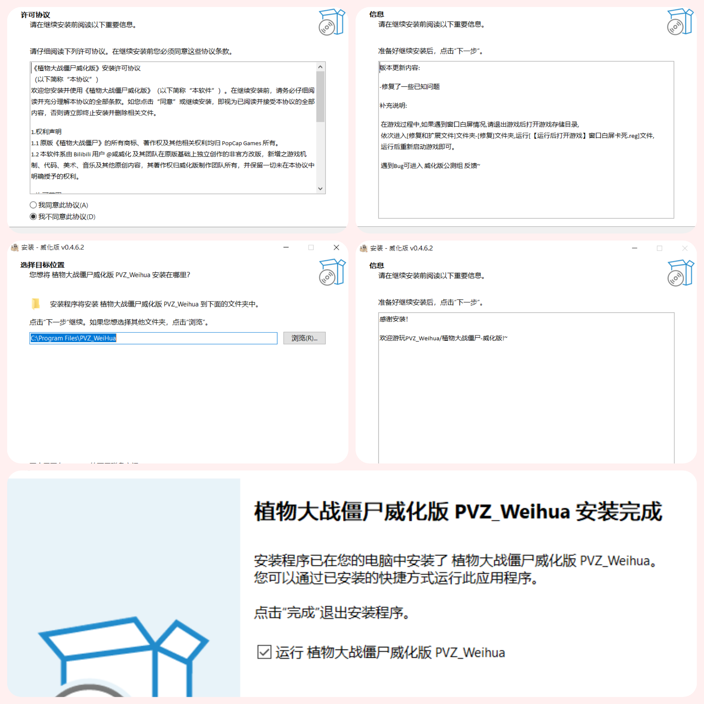

# PVZ_Weihua_installer

# 项目简介

本项目为植物大战僵尸：威化版的简易安装程序，基于 Inno Setup 和 GitHub Actions 搭建，支持一键生成 EXE 安装程序，并自动上传至 GitHub Release 页面。

# 亮点
自动化打包：集成 GitHub Actions,一键生成简易`EXE`安装程序。

简易安装向导：基于`Inno Setup`打造,支持自定义安装前后的说明文本。

白屏自动修复：支持自定义是否内置修复补丁,大幅降低玩家的游玩门槛。

# 构建方法
本项目使用`GitHub Actions`进行构建。若需发布新版本，请遵循以下流程：
1.进入仓库的 Actions 选项卡。

2.选择左侧的 Build PVZ Weihua Installer。

3.点击右侧的 Run workflow：

4.Version: 输入版本号（如 1.2.0）。

5.Update Log: 填写本次更新的具体内容。

6.等待约 2-3 分钟，Actions 将自动完成构建并上传至 GitHub Release 页面。

# Actions 执行流程
替换 IBF.txt 中的占位符。

修改 Main.iss 中的版本定义。

使用 Inno Setup v1.2.7 编译。

自动创建 GitHub Release 并上传安装包。

# 其他内容

## Github 仓库目录

- PVZ_Weihua/
- ├── .github/
- │   └── workflows/          # 自动化构建、部署、测试脚本
- ├── Game/                   # 游戏文件
- ├── src/                    # 核心内容位置
- │   └── IPT/                # 安装文本
- │       └── IAF.txt         # 安装后文本
- │       └── IBF.txt         # 安装前文本
- │       └── LF.txt          # 许可协议
- │   └── Tools/              # 工具集
- │   └── Main.iss            # 原始脚本文件
- ├── Setup/                  # inno setup 打包脚本内容
- │   └── ico.ico             # 安装图标
- │   └── ChineseSimplified.isl  # zh-cn 文件
- │   └── PVZ_Weihua.iss      # inno setup 脚本文件
- ├── .gitignore              # 忽略不需要上传的文件（如本地日志、临时备份）    
- └── README.md               # 项目主说明文档

## Screenshot

# 不足与展望
> **本仓库为简易构建库,代码质量参差不齐,望本仓库起抛砖引玉效果**
> **目前安装前文本(更新日志)自定义时易出现无法换行等的问题**
> **后续将逐步优化代码,并添加更多功能**

# 感谢
感谢 [Inno Setup](https://jrsoftware.org/isinfo.php) 提供的免费安装程序制作工具。
感谢 [GitHub Actions](https://github.com/features/actions) 提供的自动化构建服务。
